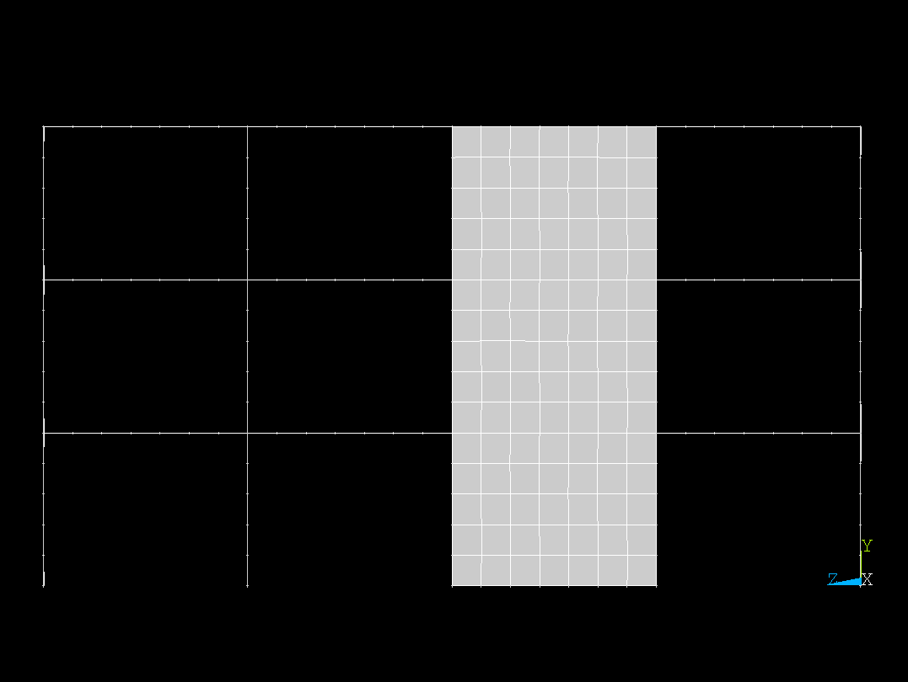
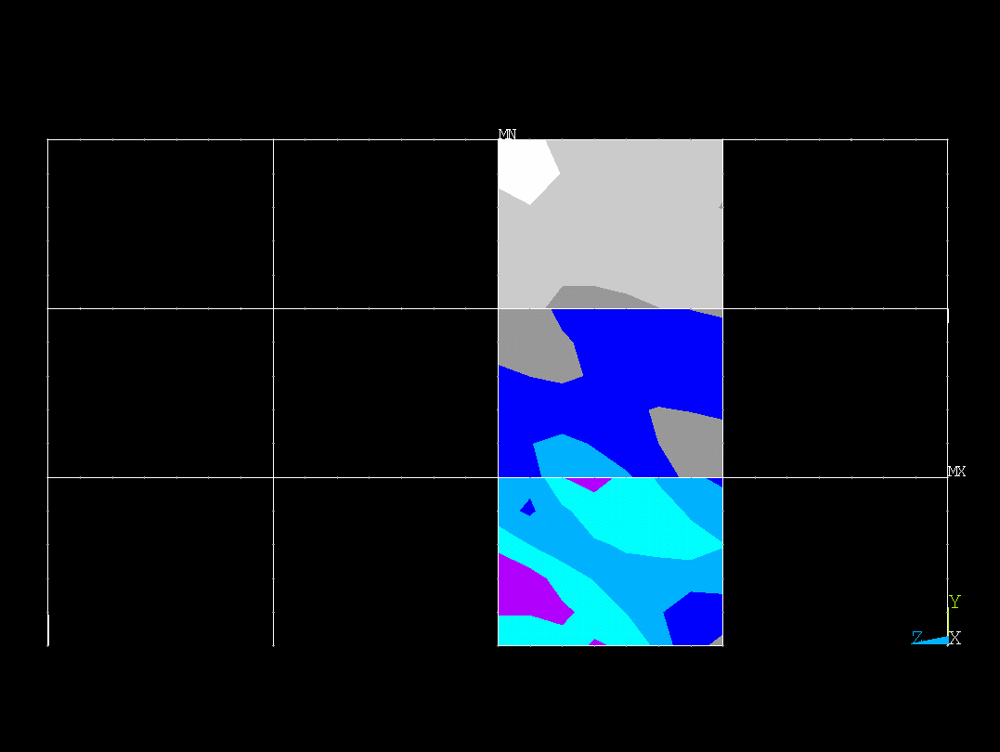

Data and Preprocessing
======================

Each synthetic building is rendered from **four viewpoints**, corresponding to the cardinal directions around the structure:

- **Front view**
- **Back view**
- **Left view**
- **Right view**

These views are captured **both before and after** the simulated earthquake:
- The **pre-quake images** represent the building geometry
- The **post-quake images** display stress distributions computed via finite element analysis (FEA)

The post-quake images use **color-coded bays** to indicate the level of stress — higher stress regions are shown in warmer colors (e.g., red), and lower stress in cooler tones (e.g., blue or green).

---

Example Input-Output Pair
-------------------------

Below is an example of one building’s input and output from the **front view**:

**Input (Pre-Earthquake):**

**Output (Post-Earthquake Stress):**

---

Each image is named according to a convention encoding:
- The **building ID**
- The **view direction**
- The **earthquake scenario**
- The **grid location** of the bay (optional)

Note that our analysis focuses only on a subset of the total bays within each
building.
In this representation, the finite elements are shown as a mesh that subdivides
the central bays.
The mesh resolution and bay layout are consistent across all buildings,
ensuring that stress patterns can be compared between different designs.
However, they may correspond to different physical sizes.
This size and layout information is stored in accompanying metadata files
provided alongside the images.

