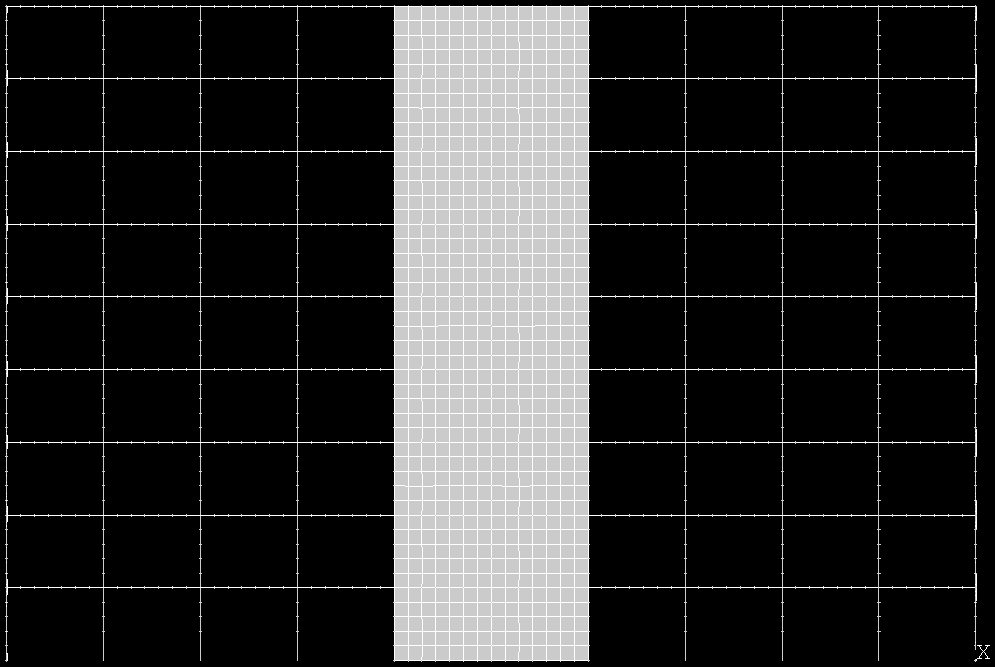
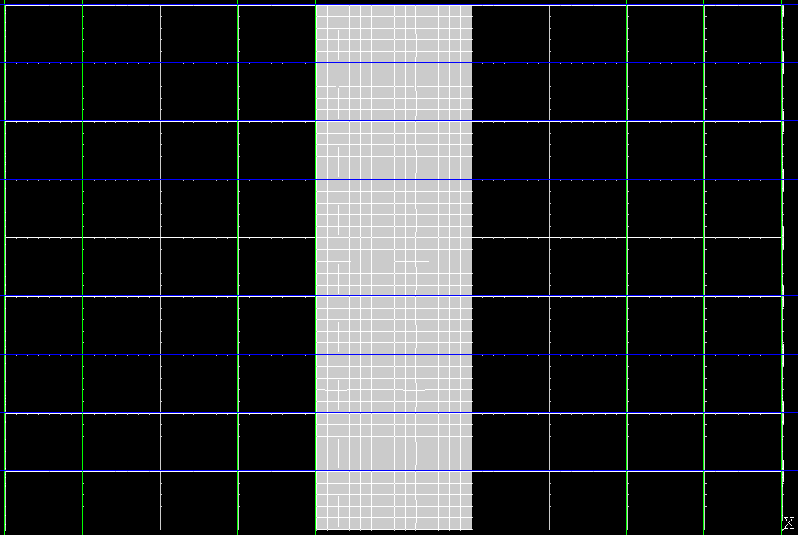
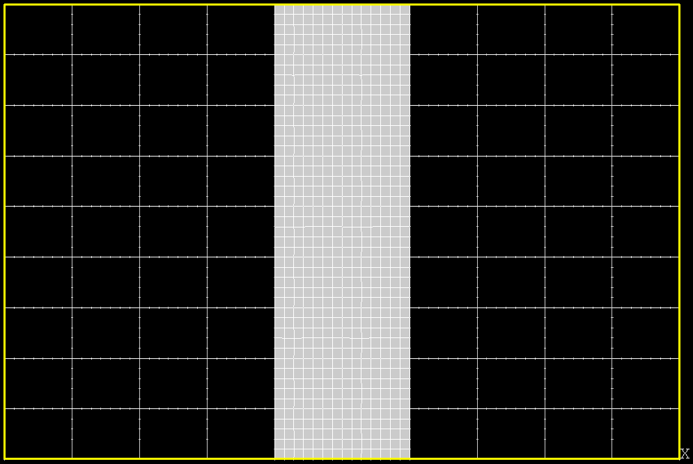

Data and Preprocessing
======================

Images
------

Our data **images** consist of a collection of synthetic buildings rendered from
**four viewpoints**, corresponding to the cardinal directions around the
structure, i.e., front, back, left, and right view.

These views are captured **both before and after** the simulated earthquake:

- The **pre-quake images** represent the building geometry
- The **post-quake images** display stress distributions computed via finite element analysis (FEA)

The post-quake images use **color-coded bays** to indicate the level of stress — higher stress regions are shown in warmer colors (e.g., red), and lower stress in cooler tones (e.g., blue or green).

Example pre-/post-Earthquake
~~~~~~~~~~~~~~~~~~~~~~~~~~~~

Below is an example of one building’s input and its corresponding output after
the application of the earthquake, both from the front view:

.. raw:: html

    

      

        
        
<em>Input (pre-earthquake geometry)</em>

      

      

        
        
<em>Output (post-earthquake stress)</em>

      

    

Note that our analysis focuses only on a **subset** of the total bays within each
building (in the examples above, the third column of bays).
In this representation, the finite elements are shown as a mesh that subdivides
the central bays.
The mesh resolution and bay layout are consistent across all buildings,
ensuring that stress patterns can be compared between different designs.
However, they may correspond to different physical sizes.
This size and layout information is stored in accompanying metadata files
provided alongside the images (see :ref:`metadata`).

Each building image pair is therefore uniquely identified by:

- the **building ID**
- the **view direction**
- the **earthquake scenario**
- the shape of the **bay grid**

.. _metadata:
Metadata and Model Features
---------------------------

In addition to the images, each building-earthquake pair is associated with a
set of **metadata** describing the structural and seismic parameters.
These include:

- **length**, **width**, and **height** of the building (measured in number of bays)
- **wall thickness** (structural thickness of each bay)
- **PGA** (*peak ground acceleration*) — a measure of earthquake intensity
- **Hz** — the dominant frequency of the ground motion

These metadata variables are used as **predictors** (*X*) in the machine
learning model, providing critical context about both the building's geometry
and the seismic input.
They enable the CNN to learn how different structural configurations and
earthquake characteristics affect the resulting stress distribution.

While the metadata serve as the input features for the predictive model,
the **post-earthquake images**—which show the stress distribution—constitute
the **target variables** (*y*).
These images provide the ground truth output that the CNN is trained to predict.

In contrast, the **pre-earthquake images** are **not** used as inputs to the
model, but just included for preprocessing purposes  (see :ref:`preprocessing`).

--

In summary, we have images for 3421 buildings, each with 4 views
(front, back, left, right)—the targets, and the corresponding
metadata—the predictors.

.. _preprocessing:
Data Preprocessing
------------------

Images
~~~~~~

Predicting the full stress map of a building as a single image is a highly
complex task, due to the high dimensionality of the output and the variability
in structural layouts.
To reduce this complexity and make the learning problem tractable, we adopt a
**per-bay** prediction strategy.
That is, rather than predicting the entire post-earthquake image at once, the
model is trained to predict the stress at the level of individual bays.
These local predictions can then be reassembled to reconstruct the complete
stress map.

Additionally, note that the images—like the examples shown above—often contain
various artifacts that our model is **not** expected to predict.
These include:

- **ticks** from the finite element mesh
- **labels** or annotations from the visualization tool
- **slightly irregular** or non-straight grid lines
- **artifacts** introduced by the earthquake simulator (e.g., white boxes)
- **inconsistent** bay sizes in pixel dimensions

These elements are removed or reduced during preprocessing: the pipeline is
specifically designed to filter out such noise and standardize the bay regions.
This ensures that the model focuses solely on learning the meaningful stress
patterns, not irrelevant visual distortions.

--

The preprocessing happens via a Computer Vision (CV) pipeline which
automatically identifies the bays on the simpler pre-earthquake images, then
applies the same segmentation to the post-earthquake images.

The process begins with each raw input image, where we first isolate the
structural content by filtering out background pixels and cropping to the
bounding region of the building.
This ensures that the analysis focuses exclusively on the meaningful geometry.

   Step 1 — Filter out non-structural pixels and crop to the relevant building
   region.

Next, we detect the underlying bay grid by identifying the most prominent
vertical and horizontal edges.

   Step 2 — Detect bay grid layout using edge detection.

The next steps involve extracting a template from the top-left cell of the
grid, which serves as a reference for the bay structure.
First, we identify the intersection points of the detected grid edges.

.. figure:: _static/preprocessing/03_intersection_DesignPointA1000.png.png
   :width: 400px
   :align: center
   :alt: Grid edge intersection detection

   Step 3 — Identify the intersection points between the detected grid edges.

Next, a template is extracted from the top-left bay, using the previously
identified intersection points.

.. figure:: _static/preprocessing/04_template_DesignPointA1000.png.png
   :width: 100px
   :align: center
   :alt: Template bay extraction

   Step 4 — Extract a template bay region from the top-left corner of the grid.

Template matching is then used to locate all other bay regions that resemble
the extracted template.

.. figure:: _static/preprocessing/05_matches_DesignPointA1000.png.png
   :width: 400px
   :align: center
   :alt: Template matching result

   Step 5 — Detect all bay regions by matching the template across the image.

From the matched grid, we compute a bounding box that encloses the full bay layout.

   Step 6 — Draw a bounding box.

We then draw a structured grid of rectangles aligned with the template dimensions,
ensuring a consistent segmentation across buildings of different sizes.

Using this grid layout, we segment the corresponding **post-earthquake output image** into
individual bay regions. These sub-images represent the localized stress state induced by the simulated earthquake.

.. figure:: _static/preprocessing/step04_output_crops.png
   :width: 400px
   :align: center
   :alt: Cropped output bay regions

   Step 4 — Crop matching bay regions from the post-earthquake image.

To standardize the data for learning, each bay image is resized to match the original template shape.
A Gaussian blur is applied to reduce high-frequency noise (like grid lines), followed by median filtering
to restore structural detail.

.. figure:: _static/preprocessing/step05_smoothed_filtered.png
   :width: 400px
   :align: center
   :alt: Smoothed and median-filtered bay images

   Step 5 — Resize and filter the bay-level images for uniformity and clarity.

Finally, any bay images that are predominantly dark (e.g., due to image artifacts or occlusion)
are excluded from the dataset. The remaining valid samples are saved using a filename
that encodes the bay’s position and the overall building layout (e.g., number of rows/columns, row and column index).

The result of this pipeline is a clean, well-aligned dataset of labeled bay-level image samples,
which can be used to train a convolutional neural network to predict localized stress patterns.
This strategy allows us to frame the problem as a structured, supervised learning task
without the complexity of generating entire stress maps in one shot.

Metadata
~~~~~~~~