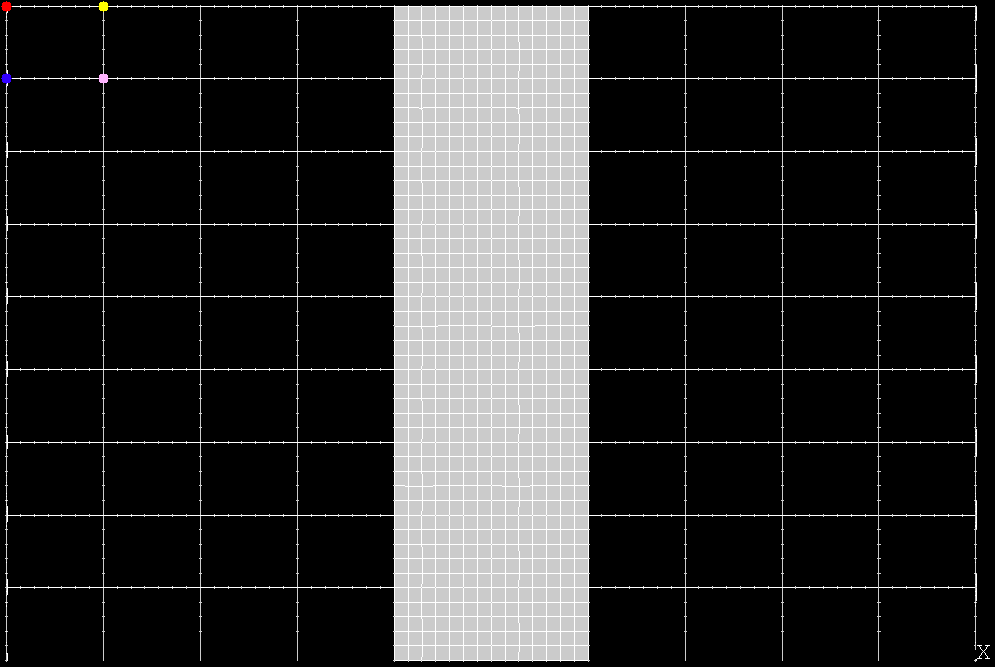
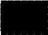
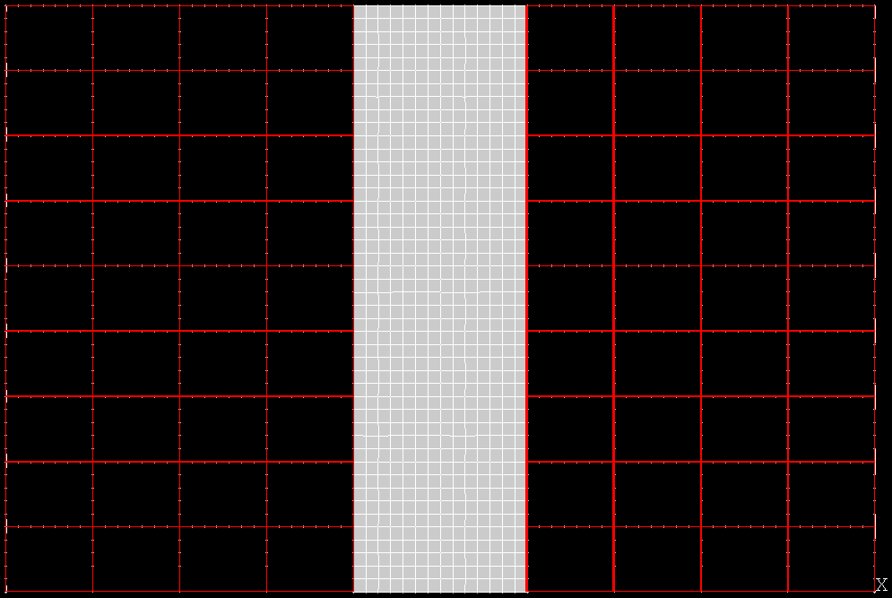
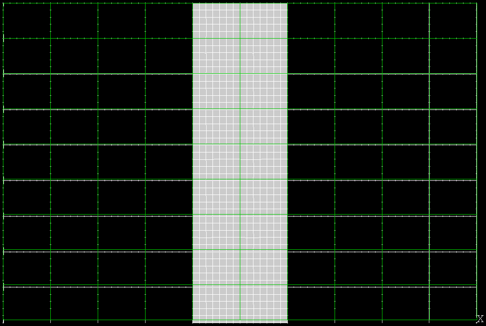
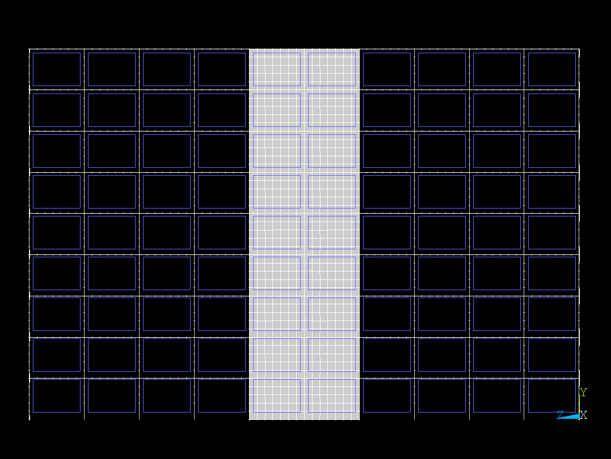

.. _data_section:

Data and Preprocessing
======================

Images
------

Our data **images** consist of a collection of 3,421 synthetic buildings
rendered from **four viewpoints**, corresponding to the cardinal directions
around the structure, i.e., front, back, left, and right view.
For each building, we therefore have:

- **4 input images** showing the structure from four cardinal directions
- **4 output images** visualizing the resulting stress after an earthquake, also from the same four directions

These views are captured **both before and after** the simulated earthquake:

- The **pre-quake images** represent the building geometry
- The **post-quake images** display stress distributions computed via finite element analysis (FEA)

The post-quake images use **color-coded bays** to indicate the level of
stress — higher stress regions are shown in warmer colors (e.g., red), and
lower stress in cooler tones (e.g., blue or green).

Example pre-/post-Earthquake
^^^^^^^^^^^^^^^^^^^^^^^^^^^^

Below is an example of one building’s input and its corresponding output after
the application of the earthquake, both from the front view:

.. list-table::
   :widths: 50 50
   :align: center
   :header-rows: 0

   * - .. figure:: _static/data/example_input_DesignPointA1000.png
         :width: 100%
         :alt: Input image

         *Input (pre-earthquake geometry)*

     - .. figure:: _static/data/example_output_DesignPointA1000.png
         :width: 100%
         :alt: Output image

         *Output (post-earthquake stress)*

Note that our analysis focuses only on a **subset** of the total bays within each
building (in the examples above, the third column of bays).
In this representation, the finite elements are shown as a mesh that subdivides
the central bays.
The mesh resolution and bay layout are consistent across all buildings,
ensuring that stress patterns can be compared between different designs.
However, they may correspond to different physical sizes.
This size and layout information is stored in accompanying metadata files
provided alongside the images (see :ref:`metadata`).

Each building image pair is therefore uniquely identified by:

- the **building ID**
- the **view direction**
- the **earthquake scenario**
- the shape of the **bay grid**

.. _metadata:

Metadata
--------

.. _table-metadata:
+------+--------+-------+--------+------------+--------+-----+----------+
| ID   | length | width | height | thickness  | PGA    | POV | Hz       |
+======+========+=======+========+============+========+=====+==========+
| 0001 | 3      | 4     | 3      | 10         | 0.2458 | B   | 5.091223 |
+------+--------+-------+--------+------------+--------+-----+----------+
| 0002 | 4      | 5     | 3      | 10         | 0.2458 | D   | 4.298888 |
+------+--------+-------+--------+------------+--------+-----+----------+
| 0003 | 5      | 6     | 3      | 10         | 0.2458 | A   | 5.398558 |
+------+--------+-------+--------+------------+--------+-----+----------+
| 0004 | 7      | 8     | 3      | 10         | 0.2458 | C   | 4.298326 |
+------+--------+-------+--------+------------+--------+-----+----------+
| 0005 | 8      | 9     | 3      | 10         | 0.2458 | B   | 3.939938 |
+------+--------+-------+--------+------------+--------+-----+----------+

In addition to the images, each building-earthquake pair is associated with a
set of **metadata** describing the structural and seismic parameters.
These include:

- **length**, **width**, and **height** of the building (measured in number of bays)
- **wall thickness** (structural thickness of each bay)
- **PGA** (*peak ground acceleration*) — a measure of earthquake intensity
- **POV** (*point of view*) — the view direction (from one of the four sides: A, B, C, or D)
- **Hz** — the dominant frequency of the ground motion

Model Features
--------------

The metadata variables are used as **predictors** (**X**) in the machine
learning model, providing critical context about both the building's geometry
and the seismic input.
They enable the CNN to learn how different structural configurations and
earthquake characteristics affect the resulting stress distribution.

While the metadata serve as the input features for the predictive model,
the **post-earthquake images**—which show the stress distribution—constitute
the **target variables** (**y**).
These images provide the ground truth output that the CNN is trained to predict.

In contrast, the **pre-earthquake images** are **not** used as inputs to the
model, but just included for preprocessing purposes  (see :ref:`preprocessing`).

.. _preprocessing:
Data Preprocessing
------------------

Computer Vision (CV) pipeline
~~~~~~~~~~~~~~~~~~~~~~~~~~~~~

Predicting the full stress map of a building as a single image is a highly
complex task, due to the high dimensionality of the output and the variability
in structural layouts.
To reduce this complexity and make the learning problem tractable, we adopt a
**per-bay** prediction strategy.
That is, rather than predicting the entire post-earthquake image at once, the
model is trained to predict the stress at the level of individual bays.
These local predictions can then be reassembled to reconstruct the complete
stress map.

Additionally, note that the images—like the examples shown above—often contain
various artifacts that our model is **not** expected to predict.
These include:

- **ticks** from the finite element mesh
- **labels** or annotations from the visualization tool
- **slightly irregular** or non-straight grid lines
- **artifacts** introduced by the earthquake simulator (e.g., white boxes)
- **inconsistent** bay sizes in pixel dimensions

These elements are removed or reduced during preprocessing: the pipeline is
specifically designed to filter out such noise and standardize the bay regions.
This ensures that the model focuses solely on learning the meaningful stress
patterns, not irrelevant visual distortions.

--

The preprocessing happens via a Computer Vision (CV) pipeline which
automatically identifies the bays on the simpler pre-earthquake images, then
applies the same segmentation to the post-earthquake images.

The process begins with each raw input image, where we first isolate the
structural content by filtering out background pixels and cropping to the
bounding region of the building.
This ensures that the analysis focuses exclusively on the meaningful geometry.

.. figure:: _static/preprocessing/01_grey_DesignPointA1000.png
   :width: 400px
   :align: center
   :alt: Whitish-pixel filter and crop

   Step 1 — Filter out non-structural pixels and crop to the relevant building
   region.

Next, we detect the underlying bay grid by identifying the most prominent
vertical and horizontal edges.

.. figure:: _static/preprocessing/02_edges_DesignPointA1000.png
   :width: 400px
   :align: center
   :alt: Grid edge detection and matching

   Step 2 — Detect bay grid layout using edge detection.

The next steps involve extracting a template from the top-left cell of the
grid, which serves as a reference for the bay structure.
First, we identify the upper-left intersection points of the detected grid edges.

   Step 3 — Identify the upper-left intersection points between the detected grid edges.

Next, a template is extracted from the top-left bay, using the previously
identified intersection points.

   Step 4 — Extract a template bay region from the top-left corner of the grid.

Template matching is then used to locate all other bay regions that resemble
the extracted template.

   Step 5 — Detect all bay regions by matching the template across the image.

From the matched grid, we compute a bounding box that encloses the full bay layout.

.. figure:: _static/preprocessing/06_bbox_DesignPointA1000.png
   :width: 400px
   :align: center
   :alt: Bounding box

   Step 6 — Draw a bounding box.

We then draw a structured grid of rectangles, each with dimentions equal to
those of the template.
This ensures a consistent segmentation into cells of equal size.
Hower, the cell grid is only an approximation of the actual bay layout, since
the bays may not be perfectly aligned or may vary slightly in size.

   Step 7 — Draw a uniform grid.

To capture the actual content of the bays, and avoid the grid lines and ticks,
we first  slightly shrunk the grid cells.

   Step 8 — Shrink all the cells.

--

This grid defines the effective segmentation of the image into individual
proxy-bay regions, which we can then apply to the corresponding post-earthquake
images.
While this process does result in minor loss of edge information around each bay,
it allows us to focus on the core structural content and avoid artifacts such
as grid lines and mesh ticks.

After extraction, each bay image is resized to match the original template
shape via bicubic interpolation.
While this does **not** preserve the exact size of every bay in the image—since
some may vary by a few pixels—it provides a consistent target size across all
samples.
For our purposes, this caveat is acceptable, as it ensures uniformity in the
training dataset.

For the post-earthquake image example shown at the top, the cropped bays of
interest extracted from the bottom row appear as shown below:

.. container:: centered-images

   .. list-table::
      :widths: 40 40
      :align: center
      :class: align-center
      :header-rows: 0

      * - .. figure:: _static/preprocessing/03_resized_R9_C10_r0_c4.png
            :width: 60%
            :alt: Extraction of the bottom-left bay

            *Extraction of the bottom-left bay*

        - .. figure:: _static/preprocessing/03_resized_R9_C10_r0_c5.png
            :width: 60%
            :alt: Extraction of the bottom-right bay

            *Extraction of the bottom-right bay*

To reduce high-frequency noise such as the grey pixels and the artifact segments
visible in the images above, a Gaussian blur is applied.

.. container:: centered-images

   .. list-table::
      :widths: 40 40
      :align: center
      :class: align-center
      :header-rows: 0

      * - .. figure:: _static/preprocessing/04_smooth_R9_C10_r0_c4.png
            :width: 60%
            :alt: Smoothed bottom-left extraction

            *Smoothed bottom-left extraction*

        - .. figure:: _static/preprocessing/04_smooth_R9_C10_r0_c5.png
            :width: 60%
            :alt: Smoothed bottom-right extraction

            *Smoothed bottom-right extraction*

This is ultimately followed by a median filtering aimed at restoring structural
detail.

.. container:: centered-images

   .. list-table::
      :widths: 60 60
      :align: center
      :class: align-center
      :header-rows: 0

      * - .. figure:: _static/preprocessing/05_median_R9_C10_r0_c4.png
            :width: 70%
            :alt: Filtered bottom-left extraction

            *Filtered bottom-left extraction*

        - .. figure:: _static/preprocessing/05_median_R9_C10_r0_c5.png
            :width: 70%
            :alt: Filtered bottom-right extraction

            *Filtered bottom-right extraction*

Finally, the dark bays—not used in the analysis (such as the first and last 4
columns in the pre-earthquake image example above)—are excluded from the dataset.

--

The result of this pipeline is a clean, well-aligned dataset of labeled
bay-level image samples, which can be used to train a deep learning model.
This strategy allows us to frame the problem as a structured, supervised
learning task without the complexity of generating entire stress maps in one
shot.

Metadata
~~~~~~~~~

The predicting variabels are assembled from the metadata introduced in
:ref:`metadata` with two minor preprocessing steps. 

First, the **POV** feature is converted from a categorical variable to a
numerical format using **one-hot encoding** (**OHE**), resulting in three new
binary columns: POV_A, POV_B, and POV_C.
The POV_D category is intentionally omitted to serve as the reference class
and to avoid introducing artificial correlations in the data.

Secondly, since we are considering the images per-bay, we add two extra columns,
**r** and **c**, indicating the row and column indices of each bay within the
building grid, allowing the model to learn spatial relationships between
adjacent bays.

The resulting metadata table, which serves as the input features for the
machine learning model, appears as follows:

+--------------------+--------+-------+--------+------------+-----+-----+--------+--------+--------+--------+----------+
| image              | length | width | height | thickness  | r   | c   | PGA    | POV_A  | POV_B  | POV_C  | Hz       |
+====================+========+=======+========+============+=====+=====+========+========+========+========+==========+
| building_1_A_bay_1 | 3      | 4     | 3      | 10         | 1   | 2   | 0.2458 | 1      | 0      | 0      | 5.091223 |
+--------------------+--------+-------+--------+------------+-----+-----+--------+--------+--------+--------+----------+
| building_1_A_bay_2 | 3      | 4     | 3      | 10         | 0   | 2   | 0.2458 | 1      | 0      | 0      | 5.091223 |
+--------------------+--------+-------+--------+------------+-----+-----+--------+--------+--------+--------+----------+
| building_1_D_bay_1 | 3      | 4     | 3      | 10         | 2   | 2   | 0.2458 | 0      | 0      | 0      | 5.091223 |
+--------------------+--------+-------+--------+------------+-----+-----+--------+--------+--------+--------+----------+
| building_5_A_bay_1 | 4      | 5     | 3      | 10         | 1   | 2   | 0.2458 | 1      | 0      | 0      | 4.298888 |
+--------------------+--------+-------+--------+------------+-----+-----+--------+--------+--------+--------+----------+
| building_5_B_bay_1 | 4      | 5     | 3      | 10         | 0   | 2   | 0.2458 | 0      | 1      | 0      | 4.298888 |
+--------------------+--------+-------+--------+------------+-----+-----+--------+--------+--------+--------+----------+

Data Summary
------------

After preprocessing and metadata integration, the dataset is organized into
two components:

- **X**: the input feature matrix, including geometric and seismic metadata along with one-hot encoded orientation.
- **y**: the target data, consisting of images representing stress distributions for individual bays.

Starting from 3,421 buildings, each captured from four different viewpoints,
we process a total of approximately 14,000 images.
From these, the pipeline extracts roughly **35,000 individual bay regions**,
which serve as the model samples.

The following table summarizes the shapes of the input **X** and targets **y**:

+-------+-------------------------------+--------------------+
| Name  | Shape                         | Data Type          |
+=======+===============================+====================+
| X     | (~35,000, 11)                 | Metadata vector    |
+-------+-------------------------------+--------------------+
| y     | (~35,000, height, width, 3)   | RGB image (target) |
+-------+-------------------------------+--------------------+