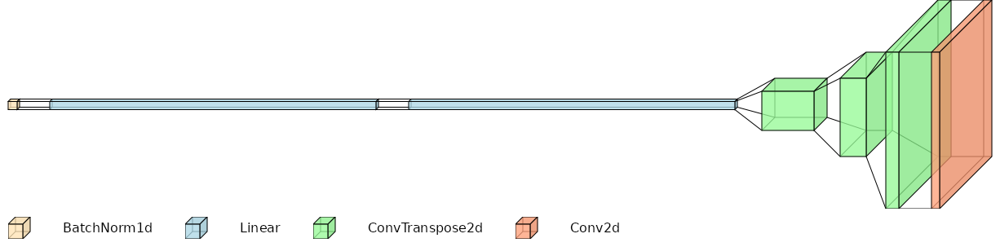
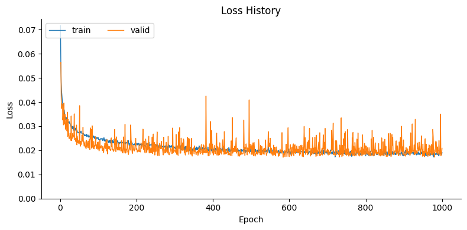

.. _model_section:

Convolutional Neural Network Model
==================================

Data loading and batching
-------------------------

The training data consists of stress image patches for individual bays, paired
with a conditioning vector as described in :ref:`data_section`.
The conditioning vectors, representing the input **X matrix**, include:

- the building geometry (length, width, height, wall thickness)
- seismic parameters (PGA, dominant frequency)
- viewpoint (encoded via one-hot vectors)
- bay location indices (row and column within the bay grid)

The data is handled using a custom PyTorch `Dataset` class that:

- Loads the conditioning vectors
- Normalizes the numeric variables using a `MinMaxScaler`
- Preserves the one-hot encoded POV variables
- Loads the corresponding post-earthquake RGB image from disk
- Resizes each image to 64 × 64 and normalizes it to the [0, 1] range

The dataset is split into three subsets using an 80/10/10 split.

Model architecture
------------------

Our predictive model is a **convolutional decoder** that generates the
post-earthquake stress image of a single building bay, conditioned on a vector
of input parameters.

   Model architecture. Diagram created with `VisualTorch <https://github.com/willyfh/visualtorch>`_.

--

The model effectively performs a **regression** from the conditioning vector
to a full-resolution RGB image, using two main stages:

1. A **fully connected projection block** transforms the input conditioning vector
into a 2D feature map

2. A stack of **transposed convolutional layers** (a.k.a. "upsampling layers")
upsamples this feature map to the desired image resolution

.. figure:: _static/model/padding_strides_transposed.gif
   :width: 240px
   :align: center
   :alt: Illustration of ConvTranspose2d upsampling with padding and strides

   Figure adapted from `conv_arithmetic repository <https://github.com/vdumoulin/conv_arithmetic/blob/master/gif/padding_strides_transposed.gif>`_

The conditioning vector is first normalized via **BatchNorm1d**, then passed
through two fully connected layers with ReLU activations.
The output of these layers is reshaped into a low-resolution 2D feature map
with a high number of channels.

This feature map is progressively upsampled by a sequence of **ConvTranspose2d**
layers, which increase the spatial resolution while reducing the number of channels.
Finally, a **Conv2d** layer with Sigmoid activation maps the upsampled features
to the desired 3-channel RGB output, normalized to the [0, 1] range.

Training
--------

The model is trained for 1000 epochs to minimize the difference between the
predicted stress images and the ground truth post-earthquake images using a
regression loss function, namely the Mean Squared Error (MSE).
Early stopping based on validation loss is applied to retain the best model checkpoint.

Training uses the Adam optimizer with a relatively low learning rate of 0.005
and a large batch size of 256.

   Training and validation loss over epochs, illustrating the model's convergence.

Notice that training is performed on all bays extracted from all points of view,
allowing the model to learn how to reproduce diverse stress patterns conditioned
on the input vector.

.. figure:: _static/model/early_prediction.png
   :width: 80%
   :align: center
   :alt: Early epoch prediction on validation set

   Example prediction from the validation set at epoch 0, showing the ground
   truth (left), model output (center), and overlay comparison (right).
