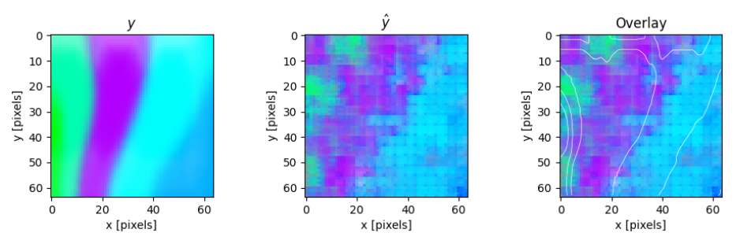

.. _prediction_section:

Model Predictions
=================

The model achieves a Mean Squared Error (MSE) of approximately 0.017 on the
test set, corresponding to a Root Mean Squared Error (RMSE) of about 13.0%
relative to the normalized image intensity range [0, 1].

   Example of prediction for a single bay, before assembling, showing
   the ground truth (left), the model prediction (center), and an overlay
   comparison (right).

Notice that the predictions are slightly pixellated, which is a common
artifact of the upsampling process in convolutional neural networks.
This is due to the model generating a low-resolution feature map that is
then upsampled to the full resolution, which can introduce some quantization
effects.

This effect is partially mitigated during the reconstruction of the building
from individual bays (:ref:`reconstruction`)..

.. _reconstruction:
Building Reconstruction
-----------------------

To visualize the predicted stress for an entire building, the model outputs
for each individual bay are first reshaped to match the size and layout of
the original bay template.
This reshaping happens via bicubic interpolation, which partially smooths out
the pixellated artifacts introduced during the upsampling process.

These predicted bay images are then systematically reassembled according to
their spatial positions within the building’s grid, effectively reconstructing
the full post-earthquake stress map of the building.

Similarly, the ground truth bay images are extracted and arranged in the same
manner, to reconstruct the ground truth.
This is done since the original bays have slightly different sizes
and aspect ratios, which can lead to minor variations in the pixel dimensions
of the reconstructed images.
Reshaping them all to the template size allows instead for direct comparison
between predictions and ground truth on a building level.

--

The following images correspond to reconstructed post-earthquake stress
distribution and the model prediction for the same building shown earlier in\
`ref:data section`.

.. raw:: html

    

      

        
        
<em>Post-earthquake stress for the building</em>

      

      

        
        
<em>Model prediction of post-earthquake stress</em>

      

    

